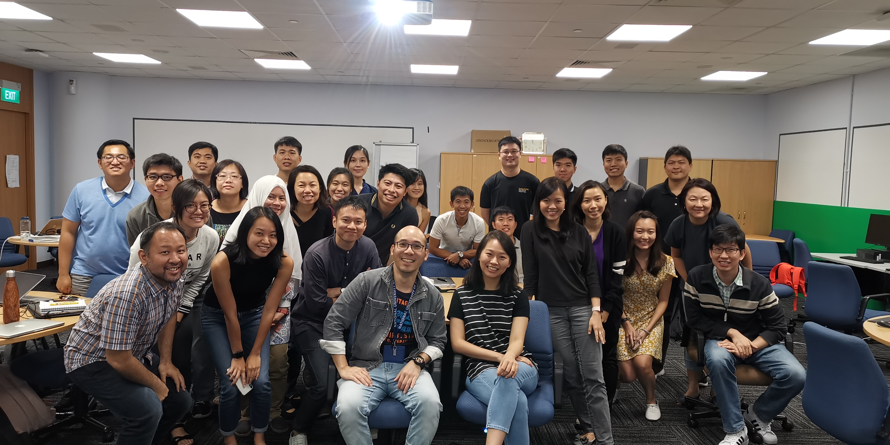

# DataAnalytics

This is an incredible learning journey for me. This is part of my NUS ISS journey where I learnt Data Analytic skills. This project is made possible by TheMovieDatabase(TMDb) where the movie reviews of popular movies was extracted from the database. We are sharing the process of Word Tokenisation, Punctuation Removal, Stopword Removal, Lemmzatization and SentimentAnalysis where we predict whether a movie review is positive or negative. Many thanks to our module coordinator Brandon Ng, who was with us all the way, so supportive and being there for us in our learning journey and the friendship and company of so many coursemates and lecturers for guiding us and generously sharing their knowledge.

